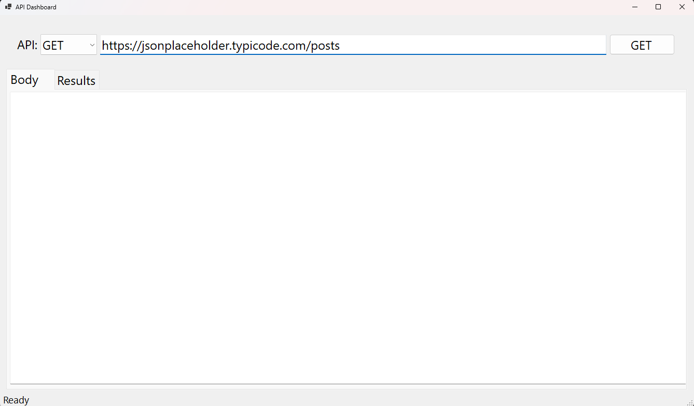
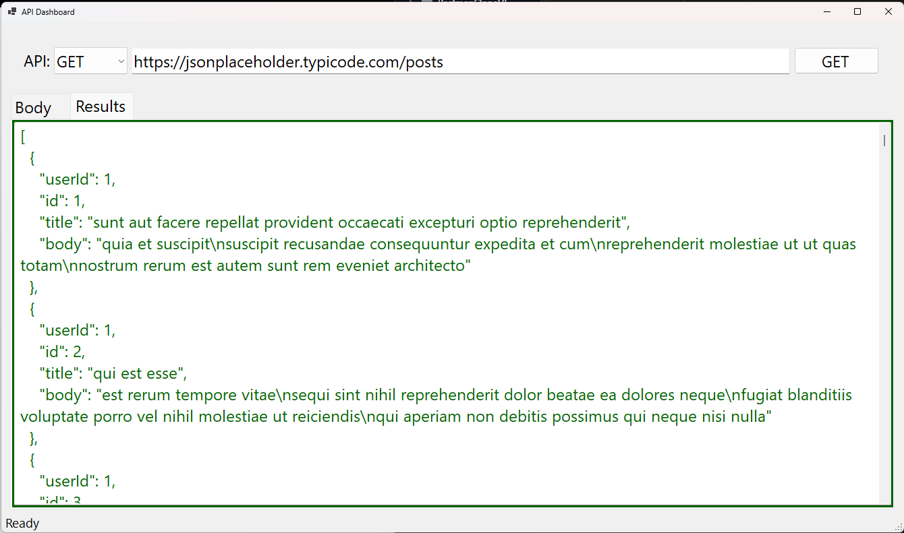
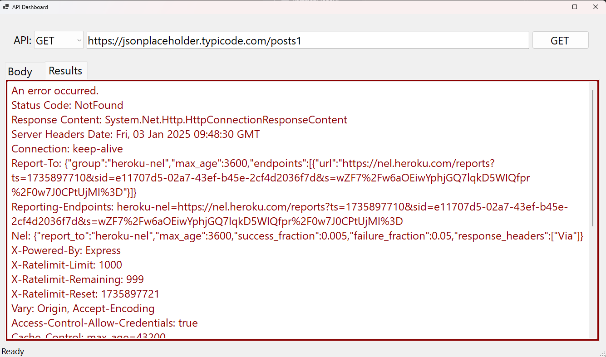

# Postman Clone
Postman Clone provides a user-friendly interface for making GET requests to APIs and viewing  the responses in formatted JSON or XML. Ideal for developers and testers, this tool simplifies API interaction and debugging, helping the user efficiently validate and troubleshoot API calls.

## Technologies Used
* C#
* .NET 8
* WinForms
* WPF
* Blazor Web Assembly
* Http CLient

## Using the App
1. Download the executable file from the relase section.
2. When the application launches, it should look like this

3. Fill in your API URL and hit GET
4. Successful requests should return:

5. Incorrect or malformed requests, should give detailed responses, allowing for analysis and problem solving.

## Version History
1. v0.1.0:
   * Initial deployment of MVP
2. v1.0.0
   * Adds POST, PUT, PATCH, DELETE
   * Various UI improvements
   * 'desktops' settings, remembering last URL & body / content from last call or each method
3. v1.0.1
  *  Adds WPF deployment
4. v1.0.2 
  * Adds Blazor WASM
  * Deployment as Azure Static Web App
    
## Upcoming Changes:
* Adding POST, PUT, PATCH and DELETE
* Adding API Headers
* Handling Authentication
* Adding Dependency Injection
* Adding Logging
* Create a web-based user interface.

